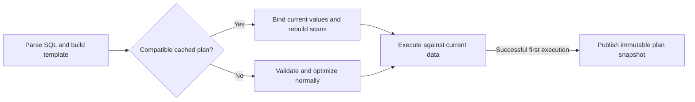

<!--
Licensed to the Apache Software Foundation (ASF) under one
or more contributor license agreements.  See the NOTICE file
distributed with this work for additional information
regarding copyright ownership.  The ASF licenses this file
to you under the Apache License, Version 2.0 (the
"License"); you may not use this file except in compliance
with the License.  You may obtain a copy of the License at

http://www.apache.org/licenses/LICENSE-2.0

Unless required by applicable law or agreed to in writing, software
distributed under the License is distributed on an "AS IS" BASIS,
WITHOUT WARRANTIES OR CONDITIONS OF ANY KIND, either express or implied.
See the License for the specific language governing permissions and
limitations under the License.
-->

# Physical plan cache

Drill normally validates and optimizes every SQL query, even when the same query
shape has just been executed. The plan cache reuses that work for repeated reads.
It caches a physical plan, not query results: every execution reads the current
source data.

The feature is opt-in and disabled by default:

```sql
ALTER SESSION SET planner.enable_plan_cache = true;
```

Use `ALTER SYSTEM` instead of `ALTER SESSION` to set the default for new queries.

## The basic idea

These queries can share a plan when the scan plugin supports it:

```sql
SELECT row_key FROM hbase.usertable WHERE row_key = 'user00000101';
SELECT row_key FROM hbase.usertable WHERE row_key = 'user00000250';
```

Drill replaces eligible data literals with typed slots when building the cache
key. Each slot carries its current value during the first planning pass. The
resulting physical expressions retain the slot number, so a later query can
replace the value without running the optimizer again. Literal type, numeric
precision and scale, and string length are part of the template.



The cache belongs to one Drillbit and can be shared across connections. Its key
includes the query user, default schema and SQL template. Each entry also records
effective planner options, plugin configurations and the compatibility version
of every referenced table, including tables inside joins, CTEs and subqueries.
A mismatch or failure falls back to ordinary planning.

The cached representation is immutable physical-plan JSON. A hit creates a new
plan object graph and binds the new values throughout its expressions. Each
participating scan must also rebuild any state derived from those values.
HBase rebuilds row-key bounds and remote filters, then discovers current regions.
Iceberg reloads table metadata and plans tasks for the current snapshot and
predicate. Reusing the first execution's filters or file list would be incorrect.

## What can be reused

Read queries can include joins, aggregates, subqueries, CTEs, ordering and limits.
Every source plugin must explicitly support caching and guarantee safe reconstruction of its scans. This change opts in HBase and Iceberg; other plugins retain the default of no support.

Constants that determine SQL structure stay in the key: group/order expressions,
window definitions, limit/offset, field selectors, and function configuration
arguments such as `DATE_PART`'s unit or `CONVERT_FROM`'s encoding. DATE, TIME,
TIMESTAMP and INTERVAL literals also stay in the key because their parameter
binding is not supported. Other eligible literals in the same query can still
be rebound. Queries with no slots can reuse their complete template.

Writes, DDL, existing dynamic parameters, volatile/query-context functions and
sessions containing temporary tables or mutable aliases bypass the cache.
Unsupported scans, views without a compatible table identity, Iceberg metadata tables and explicit
snapshot selections use normal planning.

## Storage plugin roadmap

HBase was chosen first because short queries under high concurrency are expected
to benefit most from plan caching: validation and optimization can account for a
substantial share of their latency. Since Drill is also an analytical engine,
Iceberg was included to evaluate the benefit for analytical workloads over a
data lake format. These initial integrations cover both point/range reads and
analytical scans.

Support for other commonly used plugins is planned in follow-up changes, in the
following order:

1. **DFS formats without filter pushdown**, such as CSV/TSV, JSON and Avro.
   Filtering remains in Drill's Filter operator. On bind, reconstruct the current
   file selection and redo directory partition pruning for the new values, with
   a table compatibility version that detects schema changes.
2. **Parquet.** Rebuild partition, file and row-group pruning for the current
   values and data files. Reuse the existing Parquet metadata cache where possible
   to reduce the cost of reconstruction.
3. **JDBC.** Rebuild pushed-down SQL for the current parameter values rather than
   reuse SQL containing the first execution's literals. Evaluate shared plugin
   hooks for rebuilding pushdown on bind, so JDBC and other plugins that construct
   native queries can avoid duplicating the integration logic.

Each integration must retain the inputs needed to reconstruct value-dependent
scan state and provide reliable compatibility checks, following the
[plugin developer guide](PLAN_CACHE_PLUGIN_GUIDE.md). Benchmark cache-hit planning
and end-to-end latency against ordinary planning, including metadata reads and
bind-time reconstruction. For DFS and Parquet in particular, measure file listing
and pruning costs to establish how much planning work a hit actually saves.

## Lifetime and observation

An entry is published only after the first query succeeds. A bounded background
queue performs serialization and read-back validation; a full queue simply skips
publication. Cached row-count estimates come from the first optimization;
new values and statistics changes alone do not trigger a new cost-based plan choice.

The following boot options can be overridden in `drill-override.conf`. They are
read once per Drillbit and changing them requires a restart. The effective settings
are logged at startup. `planner.enable_plan_cache` remains the runtime on/off switch.

```hocon
drill.exec.plan_cache: {
  max_size_bytes: 33554432,
  expire_after_write: 0,
  expire_after_access: 10m
}
```

- `max_size_bytes` bounds the total UTF-8 byte size of cache keys, physical-plan JSON,
  and optional explain text per Drillbit. The default is 32 MiB; entry metadata and
  Java object overhead are not included in this limit. A value of `0` disables cache storage.
- `expire_after_write` sets a fixed lifetime since creation or replacement.
  The default of `0` disables this policy; reads do not extend a configured lifetime.
- `expire_after_access` sets an idle lifetime since the last read or write.
  The default of `10m` removes unused entries while allowing active plans to remain
  cached, subject to capacity eviction and compatibility checks.

Durations accept HOCON units such as `30s`, `10m`, or `1h`. A duration of `0`
disables only that expiration policy. When both policies are enabled, an entry
expires as soon as either deadline is reached. When both are disabled, capacity
eviction and explicit invalidation still apply. All three settings must be
non-negative; invalid settings fail Drillbit startup.

Capacity eviction favors recently accessed entries using Guava's segmented LRU
policy, so entries can be evicted before their expiration deadlines or before the
global size limit is reached. Expired entries are no longer returned by lookups;
physical removal occurs during cache maintenance rather than on a background timer.
Without write-based expiration, hot plans do not periodically re-optimize. Operators
who need that behavior can configure a nonzero `expire_after_write` lifetime.

The query profile's **Plan Cache Hit** field, or JSON `planCacheHit`, identifies a
successful hit. Explain shows slot names and this execution's parameter values;
those alone do not prove a hit.

See the [plugin developer guide](PLAN_CACHE_PLUGIN_GUIDE.md) for the integration
contract. The accompanying pull request description contains validation results
and benchmark methodology.
