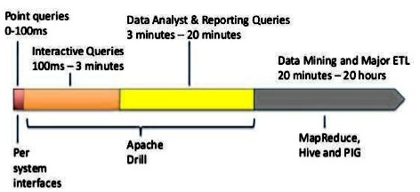

### What is Apache Drill

Apache Drill by Apache Foundation is the first open source implementation of
the Google's Dremel paper for interactive query processing. Apache Drill
provides low latency ad-hoc queries to many different data sources & nested
data. Drill is designed to scale to 10,000 servers and query petabytes of data
in seconds.

In a nutshell, Few key points about Apache Drill are:

  * Inspired by Google's Dremel
  * Supports standard SQL 2003
  * Supports plug-able data sources (HBase, Mongo, HDFS etc)
  * Supports nested data (JSON, ProtoBufs, Parquet etc)
  * Supports optional schema
  * Community driven

### Where Apache Drill fits in

Apache Drill is designed as an answer to the Interactive queries problems that
we face while dealing with huge data. A standard Drill Query might take 100ms
- 3 minutes for its execution as compared to Apache Hadoop or HIVE/PIG. Below
is a diagram to help you relate in terms of the execution times:

### Drill is powerful

Below are few things that make Apache Drill really powerful:

  * **Speed**: Apache Drill uses an efficient columnar storage format, an optimistic execution engine and a cache-conscious memory layout. Coordination, query planning, optimization, scheduling, and execution are all distributed throughout nodes in a system to maximize parallelization. Apache Drill is blazing fast. Period.
  * **Plug-able data sources**: Apache drill brings in the support of pluggable data sources like HBase, Mongo, HDFS etc. It means that Drill will still work comfortably while your data is exploring new data stores.
  * **Nested data**: With the support for data sources like HBase, Cassandra, MongoDB etc, Drill allows interactive analysis on all of your data, including nested and schema-less forms. Drill also supports querying against nested data formats like JSON and Parquet.
  * **Flexibility**: Apache Dril strongly defined tiers and APIs for straightforward integration with a wide array of technologies.

