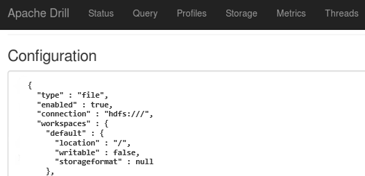

You can connect Drill to a file system, Hive, or HBase data source. To connect
Drill to a data source, you must register the data source as a storage plugin
instance in the Drill Web UI. You register an instance of a data source as a
`file`, `hive`, or `hbase` storage plugin type. You can register multiple
storage plugin instances for each storage plugin type.

Each node with a Drillbit installed has a running browser that provides access
to the Drill Web UI at `http://localhost:8047/`. The Drill Web UI includes
`cp`, `dfs`, `hive`, and `hbase` storage plugin instances by default, though
the `hive` and `hbase` instances are disabled. You can update the `hive` and
`hbase` instances with configuration details and then enable them.

The `cp` instance points to a JAR file in Drill’s classpath that contains
sample data that you can query. By default, the `dfs` instance points to the
local file system on your machine, but you can configure this instance to
point to any distributed file system, such as a Hadoop or S3 file system.

When you add or update storage plugin instances on one Drill node in a Drill
cluster, Drill broadcasts the information to all of the other Drill nodes so
they all have identical storage plugin configurations. You do not need to
restart any of the Drillbits when you add or update a storage plugin instance.

Each storage plugin instance that you register with Drill must have a distinct
name. For example, if you register two storage plugin instances for a Hadoop
file system, you might name one storage plugin instance `hdfstest` and the
other instance `hdfsproduction`.

The following example shows an HDFS data source registered in the Drill Web UI
as a storage plugin instance of plugin type "`file"`:

Click the following link to learn about workspaces:

  * [Workspaces](/confluence/display/DRILL/Workspaces)