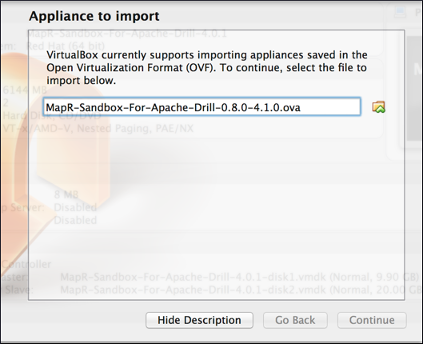
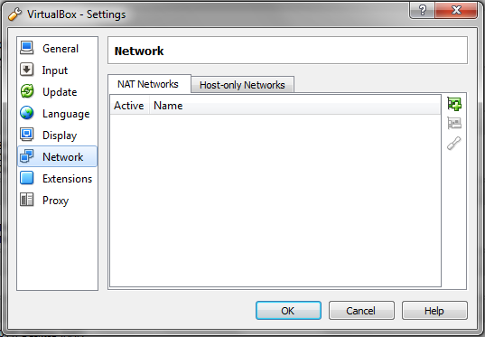
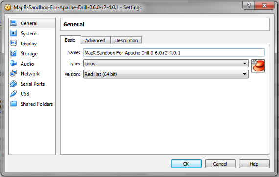

The MapR Sandbox for Apache Drill on VirtualBox comes with NAT port forwarding
enabled, which allows you to access the sandbox using localhost as hostname.

Complete the following steps to install the MapR Sandbox with Apache Drill on
VirtualBox:

  1. Download the MapR Sandbox with Apache Drill file to a directory on your machine:   
<https://www.mapr.com/products/mapr-sandbox-hadoop/download-sandbox-drill>

  2. Open the virtual machine player.

  3. Select **File > Import Appliance**. The Import Virtual Appliance dialog appears.
  
     

  4. Navigate to the directory where you downloaded the MapR Sandbox with Apache Drill and click **Next**. The Appliance Settings window appears.
  
     

  5. Select the check box at the bottom of the screen: **Reinitialize the MAC address of all network cards**, then click **Import**. The Import Appliance imports the sandbox.

  6. When the import completes, select **File > Preferences**. The VirtualBox - Settings dialog appears.
    
     

 7. Select **Network**. 

     The correct setting depends on your network connectivity when you run the
Sandbox. In general, if you are going to use a wired Ethernet connection,
select **NAT Networks **and **vboxnet0**. If you are going to use a wireless
network, select **Host-only Networks** and the **VirtualBox Host-Only Ethernet
Adapter**. If no adapters appear, click the green** +** button to add the
VirtualBox adapter.

    

 8. Click **OK **to continue.

 9. Click . The MapR-Sandbox-For-Apache-Drill-0.6.0-r2-4.0.1 - Settings dialog appears.
  
         

 10. Click **OK** to continue.

 11. Click **Start**. It takes a few minutes for the MapR services to start. After the MapR services start and installation completes, the following screen appears:

      

 12. The client must be able to resolve the actual hostname of the Drill node(s) with the IP(s). Verify that a DNS entry was created on the client machine for the Drill node(s).  
If a DNS entry does not exist, create the entry for the Drill node(s).

    * For Windows, create the entry in the %WINDIR%\system32\drivers\etc\hosts file.

    * For Linux and Mac, create the entry in /etc/hosts.  
<drill-machine-IP> <drill-machine-hostname>  
Example: `127.0.1.1 maprdemo`

 13. You can navigate to the URL provided or to [localhost:8047](http://localhost:8047) to experience the Drill Web UI, or you can log into the sandbox through the command line.

    a. To navigate to the MapR Sandbox with Apache Drill, enter the provided URL in your browser's address bar.

    b. To log into the virtual machine and access the command line, enter Alt+F2 on Windows or Option+F5 on Mac. When prompted, enter `mapr` as the login and password.

# What's Next

After downloading and installing the sandbox, continue with the tutorial by
[Getting to Know the Drill
Setup](/confluence/display/DRILL/Getting+to+Know+the+Drill+Setup).