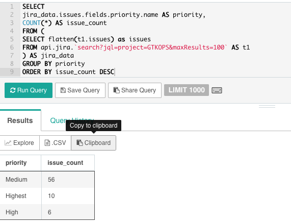

# Generic REST API Storage Plugin

This plugin is intended to enable you to query APIs over HTTP/REST. At this point, the API reader will only accept JSON as input however in the future, it may be possible to
 add additional format readers to allow for APIs which return XML, CSV or other formats.

Note:  This plugin should **NOT** be used for interacting with tools which have REST APIs such as Splunk or Solr. It will not be performant for those use cases.

## Configuration

To configure the plugin, create a new storage plugin, and add the following configuration options which apply to ALL connections defined in this plugin:

```json
{
  "type": "http",
  "cacheResults": true,
  "connections": {},
  "timeout": 0,
  "proxyHost": null, 
  "proxyPort": 0,
  "proxyType": null,
  "proxyUsername": null,
  "proxyPassword": null,
  "enabled": true
}
```
The required options are:
* `type`:  This should be `http`
* `cacheResults`:  Enable caching of the HTTP responses.  Defaults to `false`
* `timeout`:  Sets the response timeout in seconds. Defaults to `0` which is no timeout.
* `connections`:  This field contains the details for individual connections. See the section *Configuring API Connections for Details*.

You can configure Drill to work behind a corporate proxy. Details are listed below. 

### Configuring the API Connections

The HTTP Storage plugin allows you to configure multiple APIS which you can query directly from this plugin. To do so, first add a `connections` parameter to the configuration
. Next give the connection a name, which will be used in queries.  For instance `stockAPI` or `jira`.

The `connection` can accept the following options:
* `url`: The base URL which Drill will query. You should include the ending slash if there are additional arguments which you are passing.
* `method`: The request method. Must be `get` or `post`. Other methods are not allowed and will default to `GET`.
* `headers`: Often APIs will require custom headers as part of the authentication. This field allows you to define key/value pairs which are submitted with the http request
.  The format is:
```json
headers: {
   "key1": "Value1",
   "key2": "Value2"
}
```
* `authType`: If your API requires authentication, specify the authentication type. At the time of implementation, the plugin only supports basic authentication, however, the
 plugin will likely support OAUTH2 in the future. Defaults to `none`. If the `authType` is set to `basic`, `username` and `password` must be set in the configuration as well.
 * `username`: The username for basic authentication.
 * `password`: The password for basic authentication.
 * `postBody`: Contains data, in the form of key value pairs, which are sent during a `POST` request. Post body should be in the form:
 ```
key1=value1
key2=value2
```

## Usage

This plugin is different from other plugins in that it the table component of the `FROM` clause is different. In normal Drill queries, the `FROM` clause is constructed as follows:
```sql
FROM <storage plugin>.<schema>.<table>
```
For example, you might have:
```sql
FROM dfs.test.`somefile.csv`

-- or

FROM mongo.stats.sales_data
```

The HTTP/REST plugin the `FROM` clause enables you to pass arguments to your REST call. The structure is:
```sql
FROM <plugin>.<connection>.<arguments>
--Actual example:
 FROM http.sunrise.`/json?lat=36.7201600&lng=-4.4203400&date=today`
```

## Proxy Setup

Some users access HTTP services from behind a proxy firewall. Drill provides three ways specify proxy
configuration.

### Proxy Environment Variables

Drill recognizes the usual Linux proxy environment variables:

* `http_proxy`, `HTTP_PROXY`
* `https_proxy`, `HTTP_PROXY`
* `all_proxy`, `ALL_PROXY`

This technique works well if your system is already configured to
handle proxies.

### Boot Configuration

You can also specify proxy configuration in the `drill-override.conf` file.
See `drill-override-example.conf` for a template.

First, you can use the same form of URL you would use with the environment
variables:

```
drill.exec.net_proxy.http_url: "http://foo.com/1234"
```

There is one setting for HTTP, another for HTTPS.

Alternatively, you can specify each field separately:

```
drill.exec.net_proxy.http: {
      type: "none", # none, http, socks. Blank same as none.
      host: "",
      port: 80,
      user_name: "",
      password: ""
    },
```

The valid proxy types are `none`, `http` and `socks`. Blank is the same
as `none`.

Again, there is a parallel section for HTTPS.

Either of these approaches is preferred if the proxy is an attribute of your
network environment and is the same for all external HTTP/HTTPS requests.

### In the HTTP Storage Plugin Config

The final way to configure proxy is in the HTTP storage plugin itself. The proxy
applies to all connections defined in that plugin. Use this approach if the proxy
applies only to some external services, or if each service has a different proxy
(defined by creating a separate plugin config for each service.)

```json
      proxy_type: "direct",
      proxy_host: "",
      proxy_port: 80,
      proxy_user_name: "",
      proxy_password: ""
```

The valid proxy types are `direct`, `http` or `socks`. Blank is the same
as `direct`.

## Examples

### Example 1: Reference Data, A Sunrise/Sunset API

The API sunrise-sunset.org returns data in the following format:

 ```json
 "results":
 {
   "sunrise":"7:27:02 AM",
   "sunset":"5:05:55 PM",
   "solar_noon":"12:16:28 PM",
   "day_length":"9:38:53",
   "civil_twilight_begin":"6:58:14 AM",
   "civil_twilight_end":"5:34:43 PM",
   "nautical_twilight_begin":"6:25:47 AM",
   "nautical_twilight_end":"6:07:10 PM",
   "astronomical_twilight_begin":"5:54:14 AM",
   "astronomical_twilight_end":"6:38:43 PM"
 },
  "status":"OK"
}
```
To query this API, set the configuration as follows:

```json

 {
   "type": "http",
   "cacheResults": false,
   "enabled": true,
   "timeout": 5,
   "connections": {
     "sunrise": {
       "url": "https://api.sunrise-sunset.org/",
       "method": "GET",
       "headers": null,
       "authType": "none",
       "userName": null,
       "password": null,
       "postBody": null
     }
   }
}

```
Then, to execute a query:
```sql
    SELECT api_results.results.sunrise AS sunrise,
    api_results.results.sunset AS sunset
    FROM http.sunrise.`/json?lat=36.7201600&lng=-4.4203400&date=today` AS api_results;
```
Which yields the following results:
```
+------------+------------+
|  sunrise   |   sunset   |
+------------+------------+
| 7:17:46 AM | 5:01:33 PM |
+------------+------------+
1 row selected (0.632 seconds)
```

### Example 2: JIRA

JIRA Cloud has a REST API which is [documented here](https://developer.atlassian.com/cloud/jira/platform/rest/v3/?utm_source=%2Fcloud%2Fjira%2Fplatform%2Frest%2F&utm_medium=302).

To connect Drill to JIRA Cloud, use the following configuration:
```json
{
  "type": "http",
  "cacheResults": false,
  "timeout": 5,
  "connections": {
    "sunrise": {
      "url": "https://api.sunrise-sunset.org/",
      "method": "GET",
      "headers": null,
      "authType": "none",
      "userName": null,
      "password": null,
      "postBody": null
    },
    "jira": {
      "url": "https://<project>.atlassian.net/rest/api/3/",
      "method": "GET",
      "headers": {
        "Accept": "application/json"
      },
      "authType": "basic",
      "userName": "<username>",
      "password": "<API Key>",
      "postBody": null
    }
  },
  "enabled": true
}
```

Once you've configured Drill to query the API, you can now easily access any of your data in JIRA. The JIRA API returns highly nested data, however with a little preparation, it
 is pretty straightforward to transform it into a more useful table. For instance, the
 query below:
```sql
SELECT jira_data.issues.key AS key,
jira_data.issues.fields.issueType.name AS issueType,
SUBSTR(jira_data.issues.fields.created, 1, 10) AS created,
SUBSTR(jira_data.issues.fields.updated, 1, 10) AS updated,
jira_data.issues.fields.assignee.displayName as assignee,
jira_data.issues.fields.creator.displayName as creator,
jira_data.issues.fields.summary AS summary,
jira_data.issues.fields.status.name AS currentStatus,
jira_data.issues.fields.priority.name AS priority,
jira_data.issues.fields.labels AS labels,
jira_data.issues.fields.subtasks AS subtasks
FROM (
SELECT flatten(t1.issues) as issues
FROM http.jira.`search?jql=project=<project>&&maxResults=100` AS t1
) AS jira_data
```
The query below counts the number of issues by priority:

```sql
SELECT
jira_data.issues.fields.priority.name AS priority,
COUNT(*) AS issue_count
FROM (
SELECT flatten(t1.issues) as issues
FROM http.jira.`search?jql=project=<project>&maxResults=100` AS t1
) AS jira_data
GROUP BY priority
ORDER BY issue_count DESC
```




## Limitations

1. The plugin is supposed to follow redirects, however if you are using Authentication, you may encounter errors or empty responses if you are counting on the endpoint for
   redirection.

2. At this time, the plugin does not support any authentication other than basic authentication. Future functionality may include OAUTH2 authentication and/or PKI
  authentication for REST APIs.

3. This plugin does not implement filter pushdowns. Filter pushdown has the potential to improve performance.

4. This plugin only reads JSON responses. Future functionality may include the ability to parse XML, CSV or other common rest responses.

5. At this time `POST` bodies can only be in the format of key/value pairs. Some APIs accept JSON based `POST` bodies and this is not currently supported.

6. The returned message should contain only records, as a JSON array of objects (or as a series of JSON objects as in a JSON file). The
   present version does not yet have the ability to ignore message "overhead" such as status codes, etc.  You can of course, select individual fields in your query to ignore
    "overhead" fields. 
